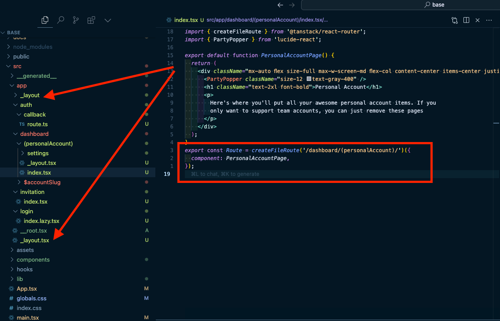

# How we created this project

# 1. node

<details>
<summary>expand</summary>

```bash
nvm install --lts # or use specific version
nvm use --lts # or use specific version
nvm alias default --lts # or use specific version
```

- `.nvmrc`
- `.npmrc`
- `engines` for `package.json`

```bash
pnpm i -g pnpm
```

</details>

# 2. vite

<details>
<summary>expand</summary>

```bash
pnpm create vite base --template react-ts
```

- set `.env.example`
- set some configs for `vite.config.ts`
  - alias for src folder
  - host for server
  - test config
  </details>

# 3. git

<details>
  <summary>expand</summary>

```bash
git init
```

- and fix `.gitignore`
- `.github/pull_request_template.md`

</details>

# 4. typescript

<details>
  <summary>expand</summary>

```bash
pnpm i @matart15/tool_config_typescript -D
pnpm i @types/node -D
```

`tsconfig.json`

`typecheck` script for `package.json`

run `pnpm typecheck` to check

</details>

# 5. eslint + prettier + husky ( for now. Maybe biome later. or hybrid)

<details>
  <summary>OLD: matart15 eslint</summary>

```bash
pnpm create @eslint/config@latest -- --config @matart15/eslint-config-specdest
pnpm add --save-dev --save-exact prettier
pnpm add --save-dev husky
pnpm exec husky init
```

- add `eslint.config.js`
- add `lint`,`lint:fix`,`fmt`,`fmt:fix` script for `package.json`
- set `/.husky/pre-commit` commands

- some hybrid implementation idea. https://zenn.dev/ryuu/articles/hybrid-sort-biome

</details>

<details>
  <summary>Changed to antfu ( no need of prettier )</summary>

```bash
pnpm i -D eslint @antfu/eslint-config
pnpm add --save-dev husky
pnpm exec husky init
```

- add `eslint.config.mjs`
- add `lint`,`lint:fix` script for `package.json`
- set `/.husky/pre-commit` commands

</details>

# 6. vitest

<details>
  <summary>expand</summary>

```bash
pnpm i vitest -D
```

- set test config for `vite.config.ts`
- add `test`, `coverage` script for `package.json`

</details>

# 7. tailwind + shadcn

<details>
  <summary>expand</summary>

```bash
pnpm add -D tailwindcss postcss autoprefixer
pnpm dlx tailwindcss init -p
pnpm dlx shadcn@latest init
pnpm dlx shadcn@latest add --all --overwrite
```

- add `src/index.css`

</details>

# 8. router

<details>
  <summary>OLD: tanstack router</summary>

    reason not to use

    
    1. need to export route file for each page
    2. layout file is outside of route folder. (editor sorts them at top and bottom) https://github.com/TanStack/router/discussions/1102

  ```bash
  pnpm add @tanstack/react-router
  pnpm add -D @tanstack/router-plugin @tanstack/router-devtools
  ```

  - setup for `vite.config.ts`
  - setup for `tsr.config.json` and set router directory to `src/app` ( just for close to NextJs )
  - Create files

  ```bash
  mkdir src/routes
  touch src/routes/__root.tsx
  touch src/routes/index.lazy.tsx
  touch src/routes/about.lazy.tsx
  touch src/main.tsx
  ```

  looks like you need to add `"moduleResolution": "Bundler",` to `tsconfig.json`

</details>

<details>
  <summary>generouted</summary>

```bash
pnpm add @generouted/react-router react-router-dom
```

- setup for `vite.config.ts`
- Create files in `src/pages`

</details>

# 9. firebase

<details>
  <summary>used for hosting</summary>

```bash
firebase login
firebase init
```

- set `firebase.json` and `/.firebaserc`
  - need to set project id
- github workflows
- `deploy:firebase:prod` script for `package.json`
- TODO: Multi site setup
  - `/` folder to example.com
  - `/admin` folder to admin.example.com

</details>

# 10. supabase

<details>
  <summary>expand</summary>

```bash
pnpm add supabase --save-dev
pnpm i @supabase/supabase-js
pnpm supabase init
mkdir src/__generated__
mkdir -p supabase/storage/u_profiles
touch supabase/storage/u_profiles/.gitkeep
```

- fix `supabase.config.toml`
- create mail templates in `supabase/templates`
- created `supabase/functions` folder
- create `supabase/storage` folder
- we use `generate-zod-schema.ts` for zod generation.

</details>

# 11. basejump ( removed )

<details>
  <summary>expand</summary>

```bash
pnpx @usebasejump/cli@latest init
```

</details>

# 12. tanstack query

<details>
  <summary>expand</summary>

```bash
pnpm add @tanstack/react-query
```

- wrap with QueryClientProvider

</details>

# 14. react-hook-form

<details>
  <summary>expand</summary>

```bash
pnpm add react-hook-form
```

</details>

# 12. nps

<details>
  <summary>expand</summary>

```bash
pnpm i -g nps
```

- set `package-scripts.yml`

</details>

# 13. cursor

<details>
  <summary>expand</summary>

[some project rules](https://docs.cursor.com/context/rules-for-ai#project-rules-recommended)

</details>

# 14. All
